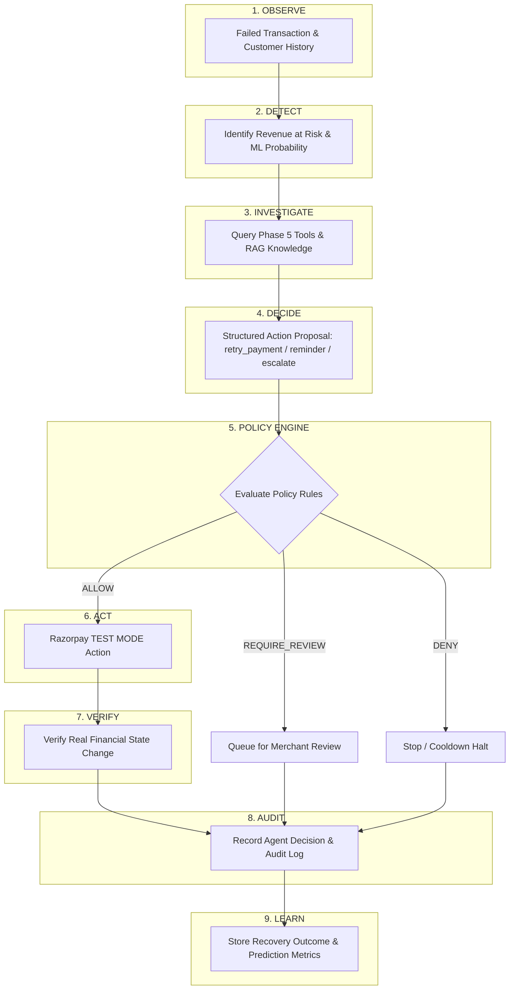

# Phase 6 — Autonomous Revenue Recovery + Policy Engine + RAG Orchestration Layer

## Overview
Phase 6 transforms RazorMind AI from an informational conversational agent into a **bounded, deterministic, autonomous revenue recovery platform**. It introduces:
1. **Policy Engine (`app/ai/policy/`)**: A non-bypassable, deterministic governance layer where all AI-suggested actions must receive explicit approval (`ALLOW`, `DENY`, `REQUIRE_REVIEW`). The LLM is never the final authority.
2. **RAG Knowledge Layer (`app/ai/rag/`)**: A merchant-isolated, zero-cloud, instant local vector search engine providing merchant policies (refunds, retries, communication, escalations) directly into decision loops without external API costs or massive dependencies.
3. **Autonomous Revenue Recovery Workflow (`app/ai/workflows/`)**: An end-to-end 9-step closed-loop orchestrator:
   $$\text{OBSERVE} \to \text{DETECT} \to \text{INVESTIGATE} \to \text{DECIDE} \to \text{POLICY CHECK} \to \text{ACT} \to \text{VERIFY} \to \text{AUDIT} \to \text{LEARN}$$
4. **Outcome Learning & Tracking (`recovery_outcomes`)**: Persistent records capturing prediction probability, chosen action, policy decision, actual result, recovered amounts, and prediction correctness for future model evaluation and fine-tuning.

---

## Architecture Diagram



---

## Core Components

### 1. Deterministic Policy Engine (`app/ai/policy/`)
- **Location**: `app/ai/policy/`
  - `engine.py`: Pure rule evaluator `PolicyEngine.evaluate(request, config)`
  - `service.py`: Database operations and default fallback policy loader
  - `schemas.py`: Pydantic models for evaluation, requests, and policy configuration
- **Configurable Rules**:
  - `enabled`: Merchant opt-in / opt-out
  - `min_recovery_probability`: Threshold below which automated recovery is escalated to human review (default: 0.65)
  - `max_recovery_amount`: Ceiling for automated actions (default: ₹10,000.00)
  - `max_attempts`: Hard stopping condition on retries (default: 2)
  - `cooldown_minutes`: Minimum window between consecutive recovery attempts (default: 60 min)
  - `allowed_actions`: Whitelist of permissible action types (`retry_payment`, `send_payment_reminder`, `create_followup`)
  - `risk_restrictions`: Tiers requiring mandatory human review (`HIGH`, `CRITICAL`)
  - `min_confidence`: Decision confidence threshold (default: 0.70)

### 2. RAG Knowledge Layer (`app/ai/rag/`)
- **Location**: `app/ai/rag/`
  - `embeddings.py`: Deterministic 128-dimensional L2-normalized vectorizer using scikit-learn & numpy. Offline, instant (<1ms), zero cloud dependency.
  - `retriever.py`: Document chunk similarity search enforcing strict merchant tenant isolation.
  - `service.py`: Document chunking, embedding generation, database persistence to `documents`, and prompt context formatting.
  - `schemas.py`: Pydantic request/response models.

### 3. Autonomous Revenue Recovery Orchestrator (`app/ai/workflows/`)
- **Location**: `app/ai/workflows/`
  - `recovery_orchestrator.py`: Implements `RevenueRecoveryOrchestrator`
  - `schemas.py`: Input/output response models
- **Stopping Rules**:
  - Payment successfully recovered -> **STOP**
  - Attempt count $\ge$ max attempts -> **STOP / DENY**
  - Transaction risk is `HIGH` or `CRITICAL` -> **REQUIRE_REVIEW**
  - Amount exceeds merchant ceiling -> **REQUIRE_REVIEW**
  - Cooldown active -> **DENY / WAIT**
  - Policy disabled -> **DENY**

### 4. Outcome Learning & Database Tracking
- Migration `003_recovery_outcomes.py` introduces `recovery_outcomes` table:
  - `opportunity_id`, `merchant_id`
  - `predicted_probability`, `chosen_action`, `policy_decision`
  - `actual_result` (`recovered`, `queued_for_review`, `stopped`, `failed`)
  - `recovered_amount`
  - `attempt_number`, `prediction_correctness`

---

## API Endpoints Reference

| Method | Endpoint | Description |
|---|---|---|
| `GET` | `/api/v1/policies` | List configured merchant policies |
| `POST` | `/api/v1/policies` | Create custom merchant policy |
| `GET` | `/api/v1/policies/{id}` | Get policy by ID |
| `PUT` | `/api/v1/policies/{id}` | Update policy configuration |
| `POST` | `/api/v1/policies/evaluate` | Directly evaluate an action against policy |
| `POST` | `/api/v1/rag/documents` | Ingest merchant knowledge document (chunked & embedded) |
| `POST` | `/api/v1/rag/query` | Semantic vector search in merchant knowledge |
| `POST` | `/api/v1/recovery/execute` | Run 9-step autonomous recovery loop |
| `GET` | `/api/v1/recovery/outcomes` | List learning outcomes for retraining |
| `GET` | `/api/v1/recovery/workflows/{id}` | Get specific workflow execution outcome |

---

## Local Verification & Demo Instructions

### 1. Execute Autonomous Recovery (Positive Scenario)
```bash
curl -X POST "http://127.0.0.1:8000/api/v1/recovery/execute" \
  -H "Content-Type: application/json" \
  -d '{"merchant_id": "<MERCHANT_UUID>", "transaction_id": "<FAILED_TX_UUID>"}'
```
**Expected Outcome**:
- Status: `completed`
- Decision: `retry_payment`
- Policy: `ALLOW`
- Verification: `recovered`
- Amount Recovered: ₹2,999.00
- Outcome persisted in `recovery_outcomes` with `prediction_correctness: true`

### 2. High Risk Transaction (Negative Scenario)
If risk score is flagged as `HIGH`:
- Policy Decision: `REQUIRE_REVIEW`
- Execution Status: `blocked`
- Verification Status: `queued_for_review`
- Amount Recovered: ₹0.00
