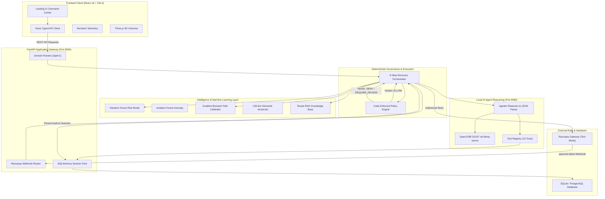

# RazorMind AI — System Architecture & Data Flow

This document details the architectural layers, data models, AI reasoning loops, and security guardrails that power RazorMind AI.

---

## 1. High-Level System Architecture Diagram

---

## 2. Architectural Subsystems

### A. Presentation Layer (`frontend/`)
- **Core:** React 18 with TypeScript 5.7, Vite 6.
- **Design System:** TailwindCSS with glassmorphic tokens, custom CRT scanline overlays, and institutional micro-animations.
- **Visuals:** Three.js / React Three Fiber interactive particle constellation; Recharts telemetry graphs; Framer Motion page transitions.
- **Networking:** Centralized typed API client (`frontend/src/lib/api.ts`) supporting dynamic base URLs (`VITE_API_BASE_URL`) for web and mobile.

### B. Application Core (`backend/app/`)
- **Framework:** FastAPI with asynchronous request handling and Pydantic v2 data validation schemas.
- **API Organization:** Modular domain routers:
  - `/transactions` — Financial ledger management.
  - `/risk` — Real-time fraud scoring and anomaly detection.
  - `/recovery` — 9-step autonomous recovery orchestrator.
  - `/policies` — Deterministic merchant guardrail configurations.
  - `/agent` — Qwen3-8B interactive tool-calling console.
  - `/audit` — Immutable flight recorder feed.
  - `/razorpay` — Gateway synchronization and test orders.
  - `/rag` — Offline semantic document retrieval.

### C. Machine Learning Pipeline (`backend/app/ai/`)
1. **Risk & Fraud Classifier:** Random forest evaluating transaction velocity, customer chargeback frequency, and deviation from merchant baseline.
2. **Anomaly Detector:** Unsupervised Isolation Forest tagging unusual transaction clusters.
3. **Calibrated Recovery Yield Model:** Gradient-boosted model estimating probability (0.00–1.00) of recovering a payment given card network, issuer decline code, and time of attempt.

### D. Local Agent Reasoning (`backend/app/ai/agent/`)
- **Engine:** Qwen3-8B-Q4_K_M GGUF executed locally via `llama-server.exe` on port 8080.
- **Function Calling:** 13 registered typed tools providing read-only inspection:
  - `get_transaction`, `get_customer_history`, `get_risk_score`, `get_policy`, `get_recovery_summary`, `search_knowledge_base`.
- **Reasoning Protocol:** Enforces strict structured JSON decision output containing diagnosis, predicted success rate, and proposed action.

### E. Deterministic Policy Engine (`backend/app/ai/policy/`)
- **Security Guarantee:** Code-enforced stopping rules written in pure Python. The LLM has zero direct write privileges to payment rails.
- **Rules Evaluated:**
  1. *Amount Ceiling:* If `amount > max_amount` $\to$ `REQUIRE_REVIEW`.
  2. *Probability Floor:* If `recovery_probability < min_probability` $\to$ `REQUIRE_REVIEW`.
  3. *Max Attempts:* If `attempt_count >= max_attempts` $\to$ `DENY`.
  4. *Cooldown:* If `now - last_attempt < cooldown_minutes` $\to$ `DENY / WAIT`.
  5. *Action Whitelist:* If `action not in allowed_actions` $\to$ `DENY`.
  6. *Risk Escalation:* If `risk_tier in [HIGH, CRITICAL]` $\to$ `REQUIRE_REVIEW`.

### F. Data Persistence Layer (`backend/app/db/`)
- **ORM:** SQLAlchemy with Alembic migration version control.
- **Entities:**
  - `Merchant` — Store profiles, API settings, and active policies.
  - `Transaction` — Incoming transactions, amounts, currencies, and gateway tokens.
  - `RecoveryOpportunity` — Flagged failure opportunities with ML yields.
  - `RecoveryAction` — Executed recovery interventions.
  - `RecoveryOutcome` — Verified financial results (recovered amounts, rate deltas).
  - `AgentDecision` — Prompt tokens, tool trace IDs, and raw LLM reasoning.
  - `AuditLog` — Tamper-evident flight logs with actors, actions, decisions, and metadata.
